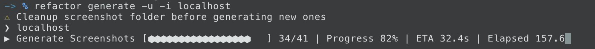
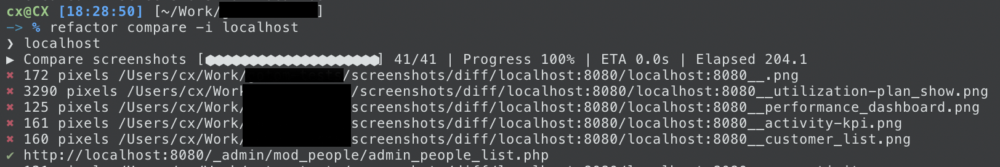

# refactor-insurance

Often during refactoring, stuff breaks and is undetected until production. With `refactor-insurance` you
can configure some urls which will be screenshotted. After you've completed your refactoring, rerun the tool to compare
the screenshots you've taken before your refactor and compare them with a newly created screenshot. If the images do not 
match, you can investigate further. 

Generate:

Compare:

## Install

    npm i -g refactor-insurance
    
## Usage

### `generate`
Generate screenshots configured in the config file

    refactor generate [--config path/to/config.json] [--update] [--folder path/to/storage] [--id ID_OF_GROUP]
    
   
### `compare`

Compare generated screenshots with new ones
    
    refactor compare [--config path/to/config.json] [--folder path/to/storage] [--threshold 200] [--id ID_OF_GROUP]
   
### Options

| Key | Type | Default | Description|
|---|---|---|---|
|--config| File | `./pages.json` | Point to your config.json file
|--folder| Folder | `./screenshots`| Directory to store all screenshots.
|--threshold| Integer| 0 | Amount of pixels which are allowed to change before triggering a warning
|--id| String| null | Run command only for a specific configured group. By default all groups are run
|--update| Boolean| false | Update already generated screenshots. Otherwise, existing screenshots won't be overridden by default 
    
    
## Config

Within the `auth` object, you can describe how the login should happen. This is useful for sites, which require
login or have a lockdown page. The `auth` object is optional.

In the `urls` you can pass a list of urls which should be compared

    [
        {
            "id": "example.com",
            "auth": {
                "url": "https://example.com/login",
                "steps": [
                    {
                        "selector": "[name='_username']",
                        "text": "foo@bar.io"
                    },
                    {
                        "selector": "[name='_password']",
                        "text": "123456789"
                    }
                ],
                "submit": "[name='_submit']"
            },
            "urls": [
                "https://example.com",
                "https://example.com/pages",
                "https://example.com/pages/2"
            ]
        },
        {
            "id": "test.example.com",
            "auth": {
                "url": "https://test.example.com/login",
                "steps": [
                    {
                        "selector": "[name='_username']",
                        "text": "foo@bar.io"
                    },
                    {
                        "selector": "[name='_password']",
                        "text": "123456789"
                    }
                ],
                "submit": "[name='_submit']"
            },
            "urls": [
                "https://test.example.com",
                "https://test.example.com/pages",
                "https://test.example.com/pages/2"
            ]
        }
    ]
